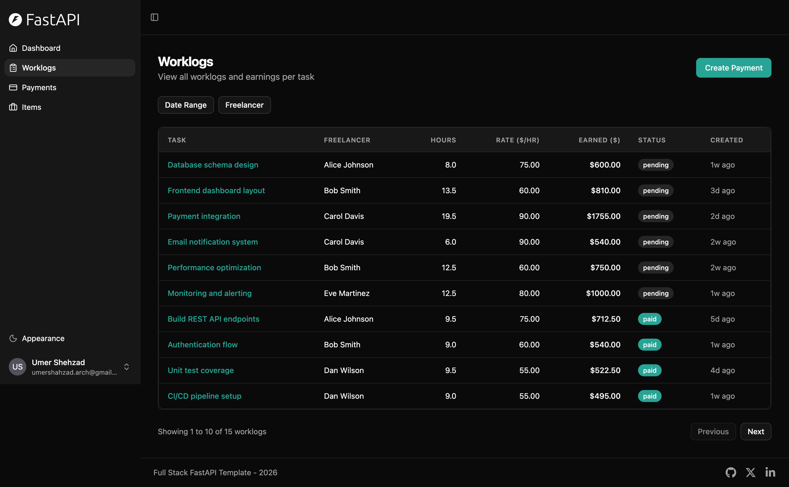
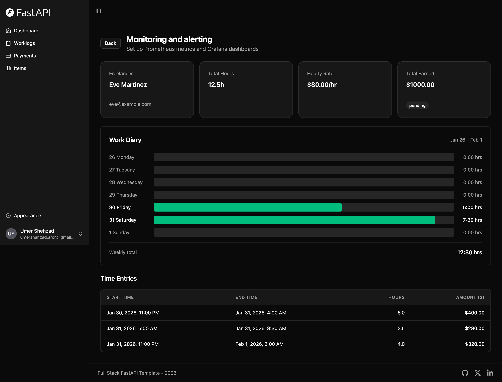

## Screenshots







# Developer Assessment 

Thank you for your interest in a developer role at **genieX** - we’re excited to learn more about you. Please refer to the appropriate assessment file based on your role:

- **Backend Assessment:** [backend.md](backend.md)
- **Fullstack Assessment:** [fullstack.md](fullstack.md)

---

## Submission Process

To submit your assessment, please follow these steps:

1. **Fork this repository**
   - Create a fork of this repository to your personal GitHub account.

2. **Raise a Pull Request**
   - Create a Pull Request from your personal fork back to this repository. Start the title with the role you've applied for. E.g. if Full Stack Developer, start the PR title with 'Full Stack:'

3. **Include Required Documentation**
   - Refer to your specific assessment file for the documentation requirements.

4. **Include Required Documentation**
   - Add your name and email id to the PR description so we can identify you

---

## Submission Checklist

- [x] Working backend APIs implementing the required functionality
- [x] Functional frontend implementing the workflows above
- [x] Added screenshots of relevant screens
- [x] Created Pull Request

---

## Setup Instructions

To start development, simply run:

```bash
docker compose up
```

This will start all required services. Once the services are up, you can access:

- **API Documentation:** `http://localhost:8000/docs`
- **Backend API:** `http://localhost:8000`
- **Frontend (Fullstack only):** `http://localhost:5173`
